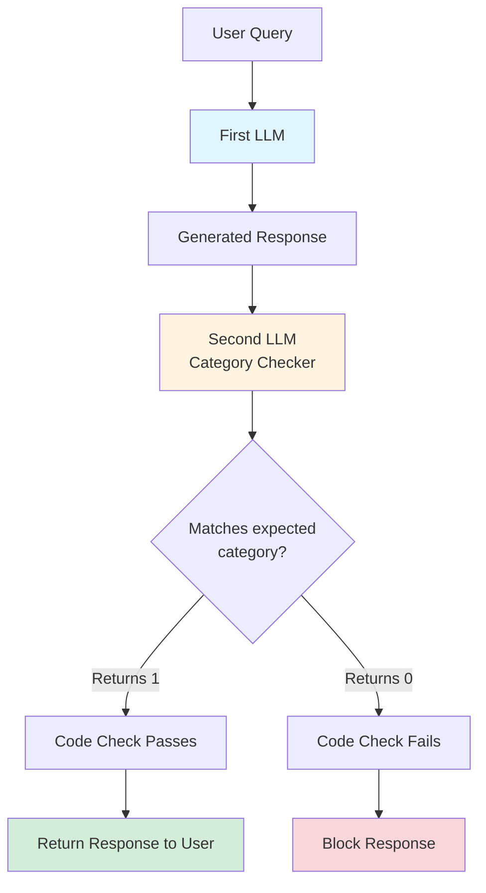

# Prompt Injection: The Misnomer Problem

Most of the popular solutions for prompt injections are bad primarily because the term "prompt injection" is a misnomer.

Nothing is being injected into your system. A malicious prompt is just another prompt. Your problem comes primarily from trying to solve prompt injection like it's a bug when it's a core feature of how an LLM works.

## Why System Prompt Warnings Don't Work

The most common solution for a prompt injection is trying to write warnings and instructions into your system prompt. But the thing is, to an LLM, text is just text. There is no inherent system inside an LLM that treats the part you write inside the Systemp Prompt of an api call vs what some malicious user writes inside their query to your LLM. To an LLM you saying "this is the system prompt" is the same as the user saying "this is the system prompt".

## The Reliable Solution

The only solution that works with 100% reliability is to add a check on the output of the LLM call before returning it to the user. You use a simple second LLM call and give it context for what your first LLM is supposed to return. For example, if the first LLM call is for a chatbot of an e-commerce store the second LLM call knows that the first LLM should return code even if the user asked for it.

Even if the first LLM falls for a malicious request, the second LLM is free from this because it sees the generation and never the user query or even the context from which the query is answered. This is the key part. No matter what the user sends to the first LLM, the output of the second LLM is either 1 or 0. 

## How The Check Works

It only checks if the generation matches the category it is supposed to match and if it does, get it to returns a static value like 1 and if it doesn't match the category get it to return a different static value. And you just add a simple check in code to see if the second Prompt Injection agent clears the response before you pass the response of the first one back to the user.

## Architecture

The second LLM only sees the generated response, not the user query or the context the first LLM used to answer. This isolation is what makes it reliable — it can't be manipulated by the same prompt that manipulated the first LLM.

## Failure Cases

Your only failure cases in this are when you are unable to correctly set the context that the second LLM call should allow for the first one in its response.

There is one edge case though that makes this work for almost 99.9% malicious requests but not for the last 0.1%. But that case is too unlikely for standard products. But you can find the solution to that edge case by extending this solution a little more. 
