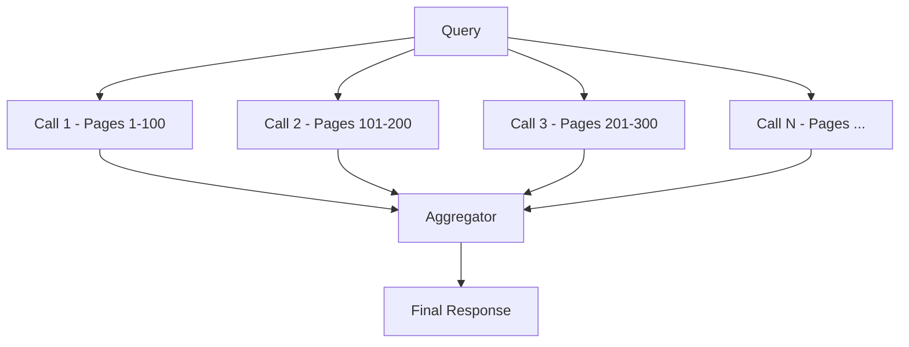
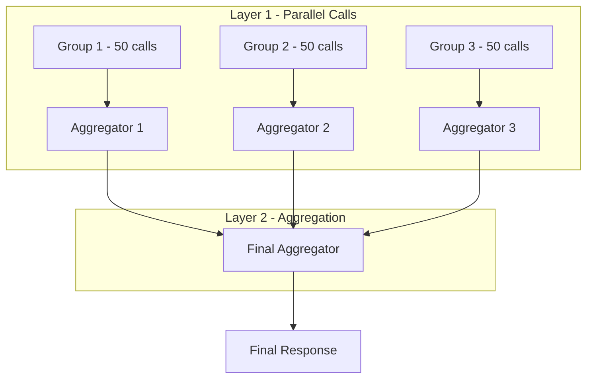
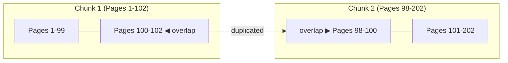

# Reliable RAG

Every RAG architecture being used is inherently unreliable. It's a mode of failure in a product that otherwise works. It's like a fully functional plane with faulty wheels. The plane _can_ fly but it can't.

## The Problem

The reason current RAG architectures are unreliable is that they try to build a solution outside of LLMs by creating embeddings, using pre-historic semantic search. These retrieval mechanisms are inherently dumb - they can't think.

If a user searches for antonyms or synonyms of words that were stored in embeddings, the relevant sections would not be found. You can try adding antonyms and synonyms in the embeddings but the ways in which data can be requested has infinite possibilities and you cannot cover every aspect in advance.

## The Solution

The solution that works reliably is to use a cheap and fast model with parallel calls. If you have five thousand pages of a PDF that is beyond context window of a single LLM call, but you can create fifty LLM calls with a hundred pages each and that would make the entire context digestible within the context windows of each call.

You pass the original context with each call and tell the LLM to return everything in the context that is relevant to the query.

This method is scalable in that you can make 50 simultaneous calls and if they process in 15 seconds, making 5000 simultaneous calls will also process in 15 seconds.

## Aggregation

What you get from these calls you put in another call and get this LLM call to decide which of the context retrieved is relevant to the original query and answer it.

The limit in the process will now be the context window of this second LLM call that aggregates the responses of the first 50 or 5000 calls.

But this is also scalable in that you need to create multiple levels of this aggregator that calls its own 50 calls and aggregates them and then another aggregates the results of these aggregators themselves. Latency increases with each new aggregator layer but each layer increases manageable context size as a square so not many layers are needed for most contexts.

## Cost

For a very cheap model, the costs of these API calls will equal to the costs of using embeddings and even get lower than using embeddings over time.

This solves the reliable RAG problem.

## Nuanced

When you break context you might break a few lines of pages that only made sense together if you broke 500 pages into 1-100 and 101-200 for pages 100 and 101. So when you break it you duplicate the last two pages on both sides. The first chunk would be 1-102 while the second chunk would be 98-202. This way context does not get lost because it got broken. Double overlap both for files and texts. Text can be broken into context.

---

The problems are complicated but the solutions are simple and the issue is people not good at understanding problems

---

## Questions & Issues

If you have any questions or run into issues implementing this, [raise an issue](https://github.com/talhaashraf94/42/issues) in this repo.

---

Warm Biscuits,
Talha Ashraf